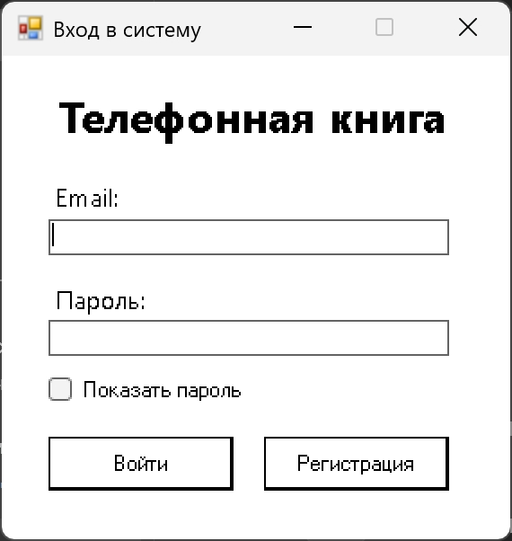
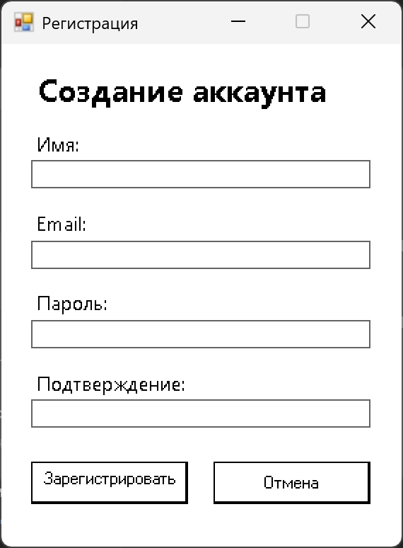
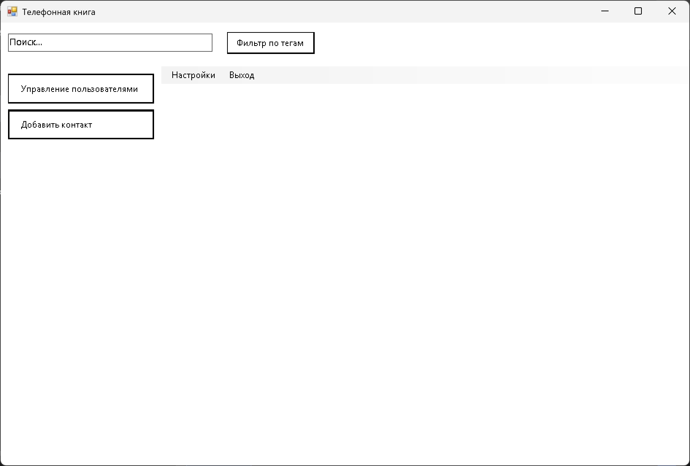
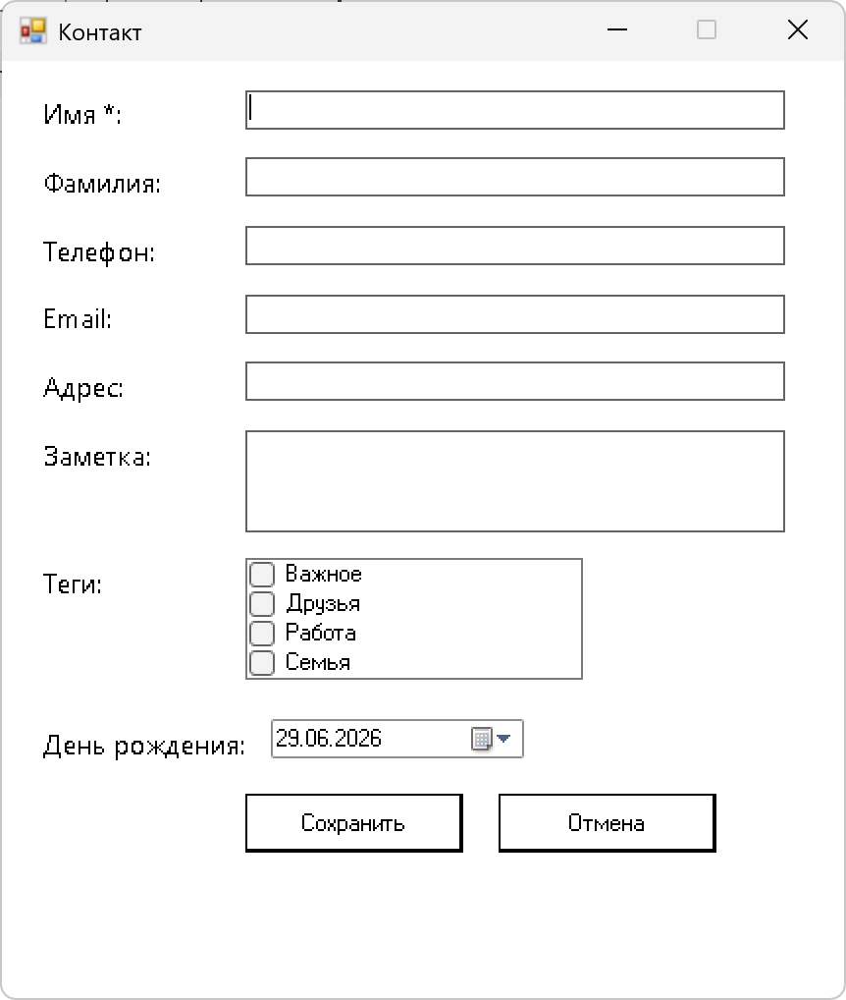
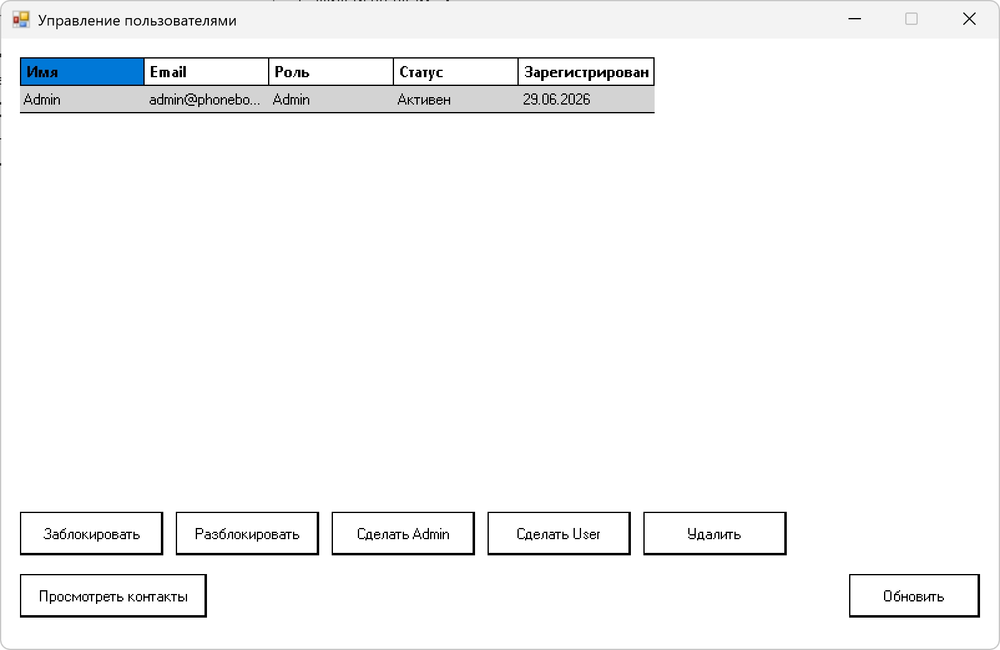

# 📱 PhoneBookApp

Настольное приложение для хранения и управления телефонной книгой с поддержкой авторизации пользователей и административной панели.

---

# Возможности

## Пользователь

* регистрация и вход в систему;
* просмотр списка контактов;
* добавление новых контактов;
* редактирование существующих;
* удаление контактов;
* поиск по имени, телефону и электронной почте;
* просмотр полной информации о контакте;
* хранение даты рождения и заметок.

## Администратор

* просмотр пользователей;
* создание новых пользователей;
* изменение ролей;
* блокировка и удаление пользователей.

---

# Руководство пользователя

## Авторизация

После запуска приложения открывается окно входа.

Введите электронную почту и пароль, затем нажмите кнопку **«Войти»**.

Если учетной записи нет, перейдите к регистрации.

<p align="center">

</p>

---

## Регистрация

Для создания новой учетной записи необходимо заполнить регистрационную форму и подтвердить создание аккаунта.

<p align="center">

</p>

---

## Главное окно

После успешной авторизации открывается главное окно приложения.

Здесь пользователь может:

* просматривать контакты;
* выполнять поиск;
* добавлять новые записи;
* редактировать существующие контакты;
* удалять контакты.

<p align="center">

</p>

---

## Контакт

При выборе контакта открывается окно с подробной информацией.

Доступны следующие действия:

* просмотр информации;
* изменение данных;
* удаление контакта;
* сохранение изменений.

<p align="center">

</p>

---

## Управление пользователями

Данный раздел доступен только администратору.

Здесь можно:

* просматривать список пользователей;
* создавать новые учетные записи;
* изменять права доступа;
* удалять пользователей.

<p align="center">

</p>

---

# Использование приложения

1. Запустите программу.
2. Зарегистрируйтесь или выполните вход.
3. Добавьте новый контакт.
4. Используйте поиск для быстрого нахождения нужной записи.
5. При необходимости измените или удалите контакт.
6. Если вы являетесь администратором, воспользуйтесь разделом управления пользователями.

---

# Используемые технологии

* C#
* .NET
* Windows Forms
* SQLite

---

# Структура проекта

```text
PhoneBookApp/
│
├── docs/                      Документация проекта
├── images/                    Изображения окон/диаграмм/макетов/графов
├── PhoneBookApp/              Исходный код (Основной проект)
│   ├── Data/                  Работа с базой данных SQLite
│   │   ├── AppDbContext.cs
│   │   └── Repositories/      Репозитории для сущностей
│   ├── Models/                Модели данных
│   │   ├── User.cs
│   │   ├── Contact.cs
│   │   └── Tag.cs
│   ├── ViewModels/            Логика и состояния окон (MVVM)
│   │   ├── LoginViewModel.cs
│   │   ├── RegistrationViewModel.cs
│   │   ├── MainViewModel.cs
│   │   ├── ContactViewModel.cs
│   │   └── UserManagementViewModel.cs
│   ├── Views/                 Графические окна (XAML / Forms)
│   │   ├── LoginWindow.xaml
│   │   ├── RegistrationWindow.xaml
│   │   ├── MainWindow.xaml
│   │   ├── ContactWindow.xaml
│   │   └── UserManagementWindow.xaml
│   ├── Services/              Бизнес-логика и сервисы
│   │   ├── AuthService.cs
│   │   ├── ContactService.cs
│   │   ├── UserService.cs
│   │   └── ValidationService.cs
│   ├── Helpers/               Вспомогательные классы и конвертеры
│   │   ├── RelayCommand.cs
│   │   └── Converters/
│   ├── Properties/            Настройки проекта
│   ├── App.config
│   ├── App.xaml
│   └── PhoneBookApp.csproj
├── packages/                  Зависимости и пакеты NuGet
└── PhoneBookApp.sln           Решение Visual Studio

---

# Требования

* Windows 10/11;
* .NET Desktop Runtime;
* Visual Studio 2022-2026.

---

# Автор

Мальков Д.Д.
